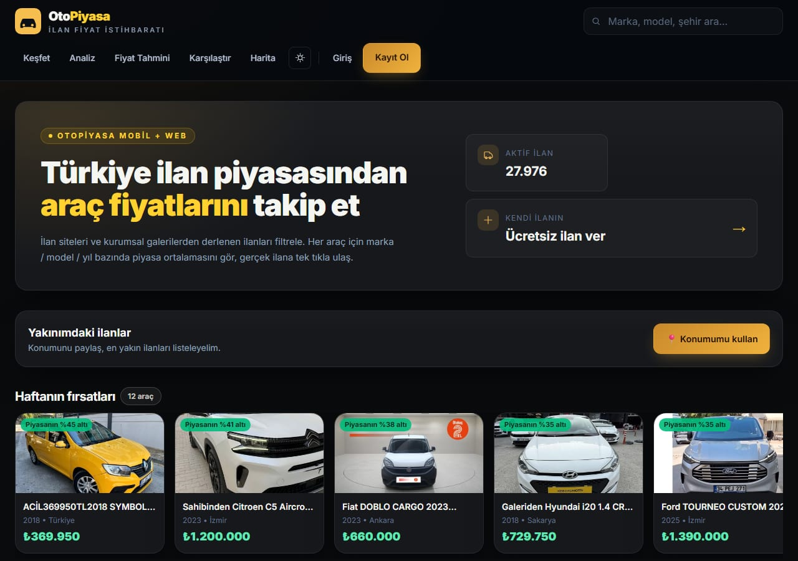
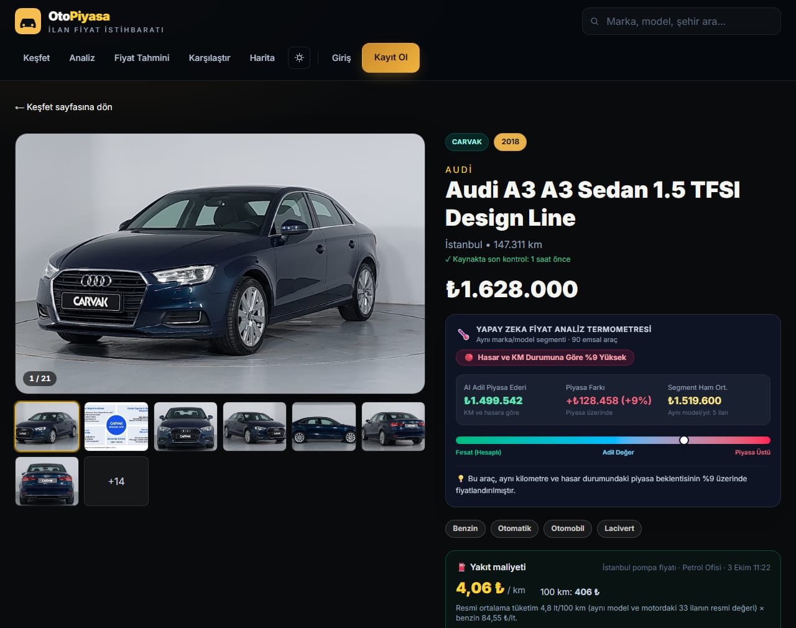
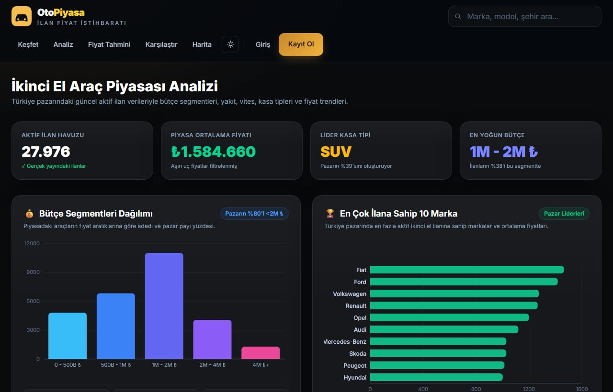
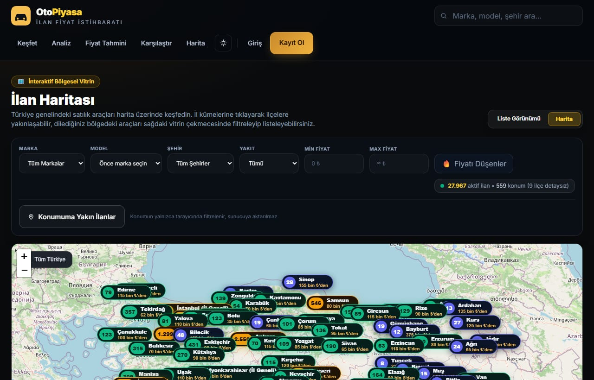
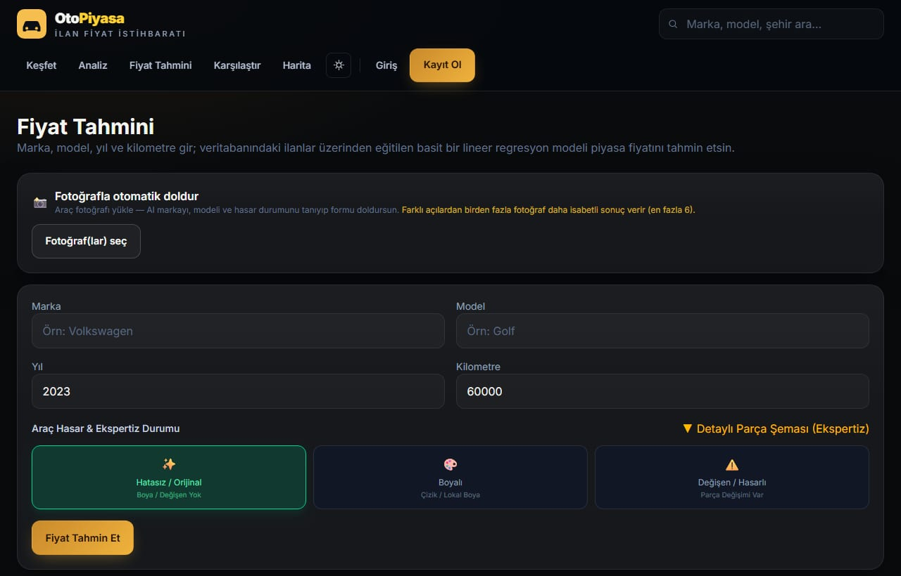
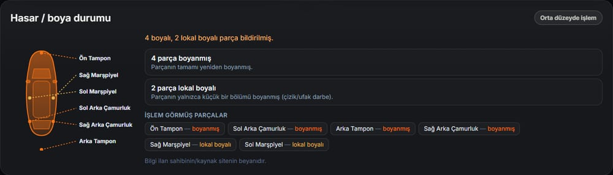
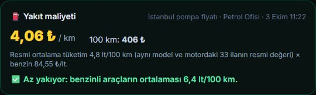
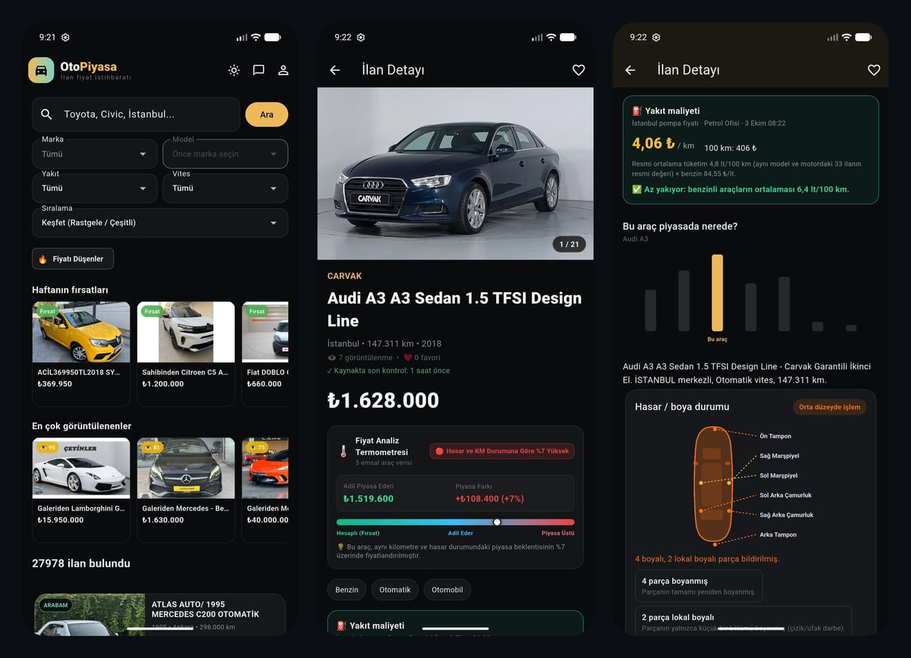
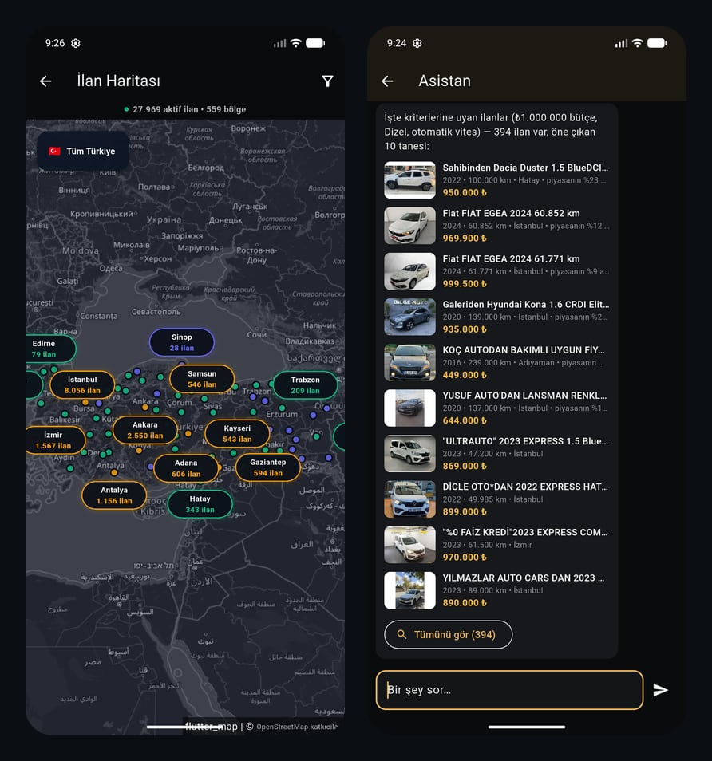

# OtoPiyasa

Türkiye'deki ikinci el araç ilanlarını bir yerde toplayıp fiyat analizi yapan bir web sitesi ve Android uygulaması. Üniversite bitirme projesi olarak yaptım.

Canlı adres: https://otopiyasa.app



## Neler yapıyor

- Farklı sitelerdeki ilanları tek yerde listeliyor ve filtreliyor (marka, model, yıl, fiyat, yakıt, vites)
- Her ilan için aynı marka, model ve yıldaki araçlara bakıp "adil fiyat" gösteriyor (fiyat termometresi)
- Fiyat tahmini: veritabanındaki ilanlardan sıfırdan yazdığım lineer regresyonla
- Hasar ve boya durumunu araç şemasında gösteriyor
- Km başına yakıt maliyeti: aracın resmi tüketimi ile günlük pompa fiyatından hesaplanıyor, şarjlı hibritlerde elektrik de ekleniyor
- Harita, yakınımdaki ilanlar, araç karşılaştırma ve marka bazlı analiz sayfası
- Favoriler ve abonelik: istediğin kritere uyan ilan çıkınca ya da fiyat düşünce haber veriyor
- Basit bir asistan: "1 milyon altı dizel otomatik araba öner" gibi sorulara ilan listesiyle cevap veriyor
- Satılan ilanlar silinmiyor, "Piyasa Arşivi"ne taşınıyor, fiyat tahmini bunları da kullanıyor
- Admin paneli ve Flutter ile yazılmış mobil uygulama (hücresel veride küçük fotoğraf indiren veri tasarrufu var)

## Ekran görüntüleri

Web

| | |
|---|---|
|  |  |
|  |  |

Hasar şeması ve yakıt maliyeti





Mobil





## Kullandığım teknolojiler

- Web ve API: Next.js 15, React 19, TypeScript, Tailwind CSS
- Veritabanı: MongoDB (Mongoose), canlıda MongoDB Atlas
- Giriş: JWT, httpOnly cookie, bcrypt
- Grafik ve harita: Recharts, Leaflet
- Veri çekme: Playwright ve Cheerio
- E-posta: Nodemailer
- Mobil: Flutter
- Yayın: Vercel (web), veri çekme motoru için Oracle Cloud sunucusu

## Veri nereden geliyor

Arabam.com, Otokoç 2. El, Otoplus, VavaCars, Carvak, Otomerkezi, DOD ve İkinciyeni'den ilan çekiliyor. Sahibinden.com Cloudflare koruması yüzünden çekilemiyor.

Arabam.com da Cloudflare kullanıyor, sadece gerçek bir tarayıcıyla ve Türkiye'deki ev internetinden çalışıyor. Bu yüzden sunucuda kapalı, sadece ev bilgisayarında açılıyor.

Bu proje akademik amaçlı ve ticari değil. İlanlar sadece analiz için toplanıyor, her ilan kendi kaynağına bağlantı veriyor ve tüm hakları kaynak sitelere ait.

## Veri çekme motoru

`scripts/daemon.ts` 7/24 çalışıyor. Her turda yeni ilanları buluyor, sırası gelen kaynağın bütün listesini baştan sona tarayıp fiyat değişikliklerini güncelliyor ve satılanları arşive alıyor. Bir ilanı satıldı saymadan önce sayfası kontrol ediliyor. Site engellediyse ya da cevap vermediyse ilan arşive atılmıyor.

Arabam ilanlarının hâlâ yayında olup olmadığını evdeki bilgisayar kontrol ediyor. `arabam-bekci-kur.bat` bunu Windows Görev Zamanlayıcı'ya ekliyor, bilgisayar açılınca arka planda kendi başlıyor ve yaklaşık 10 saniyede bir ilanın kendi sayfasını açıp bakıyor (saatte ~360 ilan). Cloudflare engel verirse 15 dakika, sonra 30, 60, 120 dakika bekleyip tekrar deniyor. Ne yaptığı yönetim ekranında (web ve mobil) görünüyor: çalışıyor mu, bugün kaç ilan kontrol edildi, günlük özet ve güne tıklayınca saat saat döküm. Terminalden durumuna `arabam-bekci-durum.bat` ile bakılıyor, `arabam-bekci-kaldir.bat` ile kaldırılıyor.

Sunucuda `pm2 start ecosystem.config.cjs` ile başlıyor, güncellemek için `bash scripts/update-server.sh` çalışıyor. Elle çalıştırmak için `scrape.bat` (menüden seçiliyor), ölü ilanları temizlemek için `temizle-olu-ilanlari.bat` var. Kaynakların çalışıp çalışmadığına `npx tsx scripts/scraper-health.ts` ile bakılabiliyor.

## Çalıştırma

```
npm install
copy .env.example .env      (içini doldur: MONGODB_URI, JWT_SECRET, SMTP bilgileri)
npm run dev                 (http://localhost:3000)
```

Windows'ta `start.bat` ile de açılıyor. Demo veri için `npm run seed`, gerçek veri için `scrape.bat`.

Mobil uygulama:

```
cd mobile
flutter pub get
flutter run
```

## Test

```
npm test
npx tsc --noEmit
cd mobile && flutter test && flutter analyze
```

## Klasörler

```
src/app/        sayfalar, API route'ları, admin paneli
src/components/ React bileşenleri
src/lib/        veri çekme, regresyon, piyasa hesabı, yakıt maliyeti, giriş sistemi
src/models/     Mongoose şemaları
mobile/         Flutter uygulaması
scripts/        veri çekme motoru, bakım betikleri
docs/img/       README'deki ekran görüntüleri
```

Daha ayrıntılı anlatım için `dokümantasyon.md` dosyasına bakılabilir.

## Notlar

- Piyasa ortalaması sayfadaki ilanların değil, o aracın marka, model ve yıl grubunun ortalamasıdır
- Elektrik fiyatı için günlük bir kaynak bulamadım, şarjlı hibritlerdeki elektrik maliyeti tahmindir (kodda `ELECTRICITY` sabiti, üç ayda bir elle güncelliyorum)
- Vercel ücretsiz planda aylık veri sınırı var, bu yüzden ana sayfa ve liste API'leri CDN'de önbelleğe alınıyor
- Oracle Linux'ta SELinux açıkken pm2 servisi sürekli yeniden başlıyordu. `pm2-opc.service` dosyasındaki `PIDFile` satırını silince düzeldi (`sudo sed -i '/^PIDFile=/d' /etc/systemd/system/pm2-opc.service`, sonra `daemon-reload` ve `restart`)
- OneDrive içinde çalışırken `.next` klasörü bozulabiliyor ("React Client Manifest" hatası). `npm run dev`'i durdurup `.next` klasörünü silmek yetiyor
